# iLex / IEL — Field Logistics Mobile Application

> **Flutter cross-platform client** for [iLex](https://app.ilex.sa) courier operations: trips, shipments, tracking, pricing, QR workflows, push notifications, and **Sunmi thermal printer** integration for on-site labels and receipts.  
> **Locale:** Arabic (`ar`) · **Platforms:** Android & iOS · **Pattern:** GetX (navigation, DI, reactive state)

This document is written for **portfolio and CV use**: it summarizes the product, technical stack, **architecture**, **navigation graph**, **domain workflows**, and **repository layout** with diagrams you can render in GitHub, GitLab, Notion, or any Markdown viewer that supports [Mermaid](https://mermaid.js.org/).

---

## Table of contents

1. [Elevator pitch (CV-ready)](#elevator-pitch-cv-ready)
2. [Product scope](#product-scope)
3. [Technology stack](#technology-stack)
4. [System context](#system-context)
5. [Application architecture](#application-architecture)
6. [Bootstrap and runtime services](#bootstrap-and-runtime-services)
7. [Navigation and dependency injection](#navigation-and-dependency-injection)
8. [User journeys and workflows](#user-journeys-and-workflows)
9. [Domain: trips vs shipments](#domain-trips-vs-shipments)
10. [Networking and API surface](#networking-and-api-surface)
11. [Integrations deep dive](#integrations-deep-dive)
12. [Printing system (Sunmi thermal labels)](#printing-system-sunmi-thermal-labels)
13. [Repository / file architecture](#repository--file-architecture)
14. [Screen and route catalog](#screen-and-route-catalog)
15. [Getting started](#getting-started)
16. [Security and configuration notes](#security-and-configuration-notes)

---

## Elevator pitch (CV-ready)

- **Built a production-oriented logistics operations app in Flutter / Dart 3**, integrating a REST backend (`https://app.ilex.sa/api/v1`) via **Dio**, with **GetX** for routing, lazy bindings, and reactive UI.
- **Implemented end-to-end field workflows**: shipping vs delivery trips, shipment CRUD and tracking, **infinite-scroll** lists, **QR** scanning for trips and shipments, **Firebase Cloud Messaging**, **geolocation**, signatures, PDF flows, and **Sunmi POS thermal printing** (`sunmi_printer_plus`) with RTL-aligned tickets and QR codes.
- **Emphasized operational reliability**: portrait lock, **GetStorage** persistence, **connectivity** awareness, optional **offline overlay**, forced **app upgrade** gate vs store version, and shared validation / communication helpers.

---

## Product scope

| Area | Capability |
|------|------------|
| **Authentication** | Login, forgot password, token storage, device/location context on login |
| **Trips** | Create shipping trip (`trip1branches`) and delivery trip (`trip2delivery`), list/search trips, trip details, shipments on trip, trip QR |
| **Shipments** | Create shipment, calculate price, list/search, details, packages, delivery update, shipment QR |
| **Profile / settings** | User info, change password |
| **Notifications** | FCM-backed notification UI |
| **Printing** | Shipping label / receipt output on **Sunmi** hardware with text, rules, and QR |
| **Localization** | Arabic-first UI strings and RTL-friendly layouts |

---

## Technology stack

| Layer | Choice |
|-------|--------|
| **Framework** | Flutter |
| **Language** | Dart `^3.6.0` |
| **State / navigation / DI** | [get](https://pub.dev/packages/get) — `GetMaterialApp`, `GetPage`, `Bindings`, `GetxController`, `Obx` |
| **HTTP** | [dio](https://pub.dev/packages/dio) — wrapped by `ApiService` |
| **Local storage** | [get_storage](https://pub.dev/packages/get_storage) |
| **Push** | Firebase Core + Firebase Messaging |
| **Responsive UI** | [sizer](https://pub.dev/packages/sizer) |
| **Pagination** | [infinite_scroll_pagination](https://pub.dev/packages/infinite_scroll_pagination) |
| **QR** | [mobile_scanner](https://pub.dev/packages/mobile_scanner), [pretty_qr_code](https://pub.dev/packages/pretty_qr_code) |
| **Geo** | [geolocator](https://pub.dev/packages/geolocator), [geocoding](https://pub.dev/packages/geocoding) |
| **Printer** | [sunmi_printer_plus](https://pub.dev/packages/sunmi_printer_plus) |
| **Connectivity** | [connectivity_plus](https://pub.dev/packages/connectivity_plus) |
| **Upgrades** | [upgrader](https://pub.dev/packages/upgrader) |
| **Hooks** | [flutter_hooks](https://pub.dev/packages/flutter_hooks) in select views |

---

## System context

High-level view of this app within the iLex ecosystem:

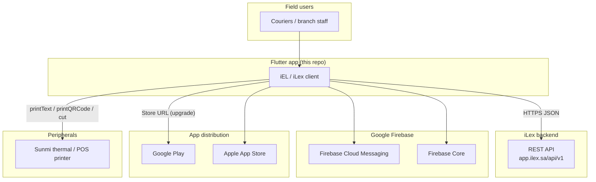

---

## Application architecture

The codebase follows a **layered, feature-oriented** layout under `lib/`: **views** (UI), **controllers** (GetX state + orchestration), **services** (API calls), **models** (DTOs / entities), **bindings** (lazy registration), plus **core** shared utilities.

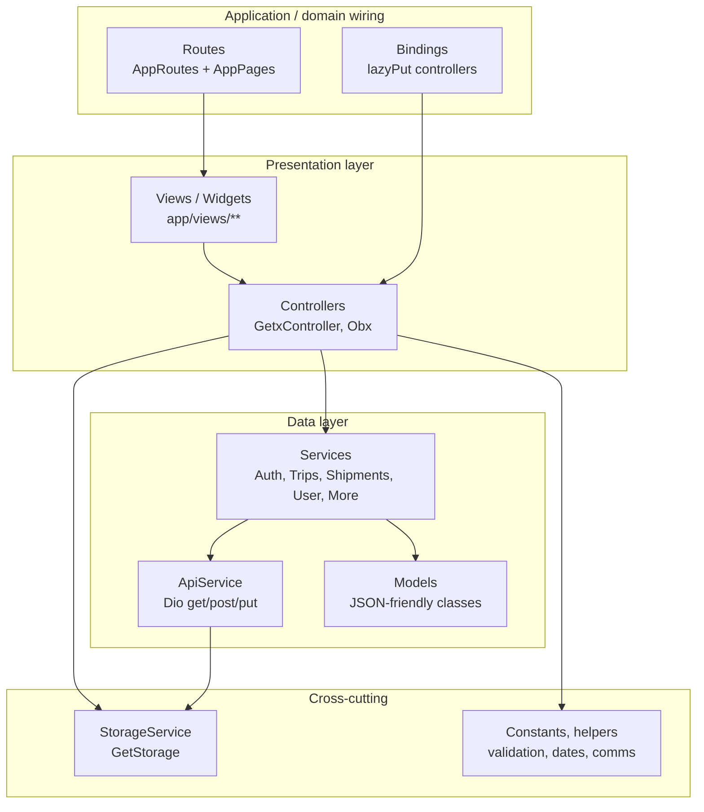

**Request flow (simplified):**

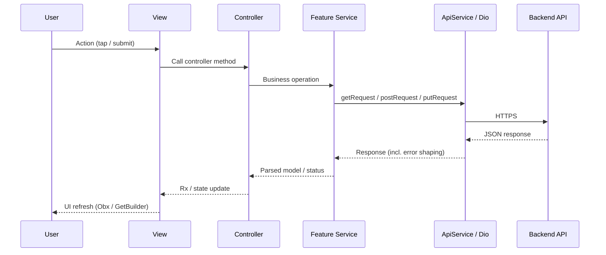

---

## Bootstrap and runtime services

On launch, `main.dart` awaits `InitServicesHelper.initServices()` before `runApp`:

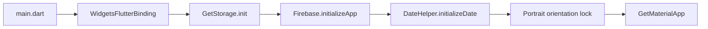

---

## Navigation and dependency injection

- **Entry route:** `AppPages.initial` → `AppRoutes.splashView`
- **Routing:** `GetMaterialApp` + `getPages: AppPages.routes`
- **DI:** Per-screen `Binding` classes use `Get.lazyPut` to register controllers when the route opens

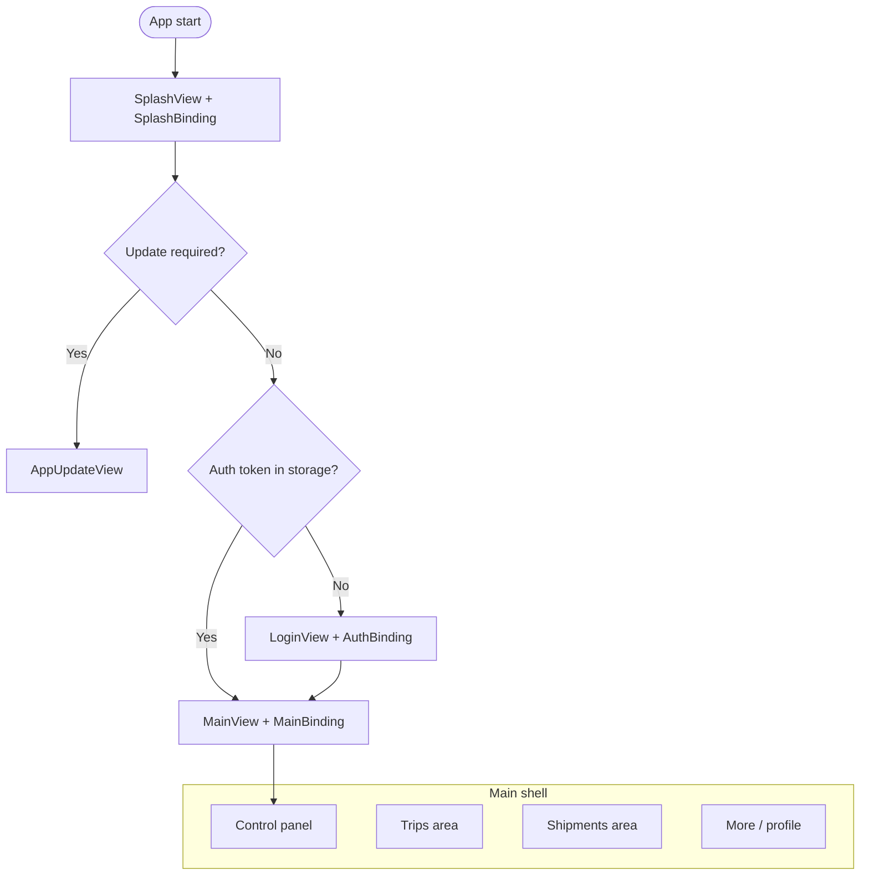

**Main shell** hosts primary navigation (control panel, trips, shipments, more) via `MainController` tab index; feature screens push additional `GetPage`s with optional `TripsBinding` or `ShipmentsBinding`.

---

## User journeys and workflows

### A. Cold start: splash, upgrade gate, session

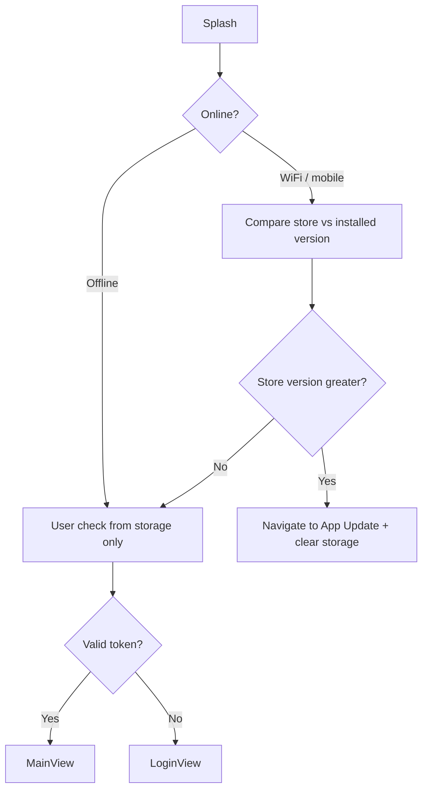

### B. Authentication (conceptual)

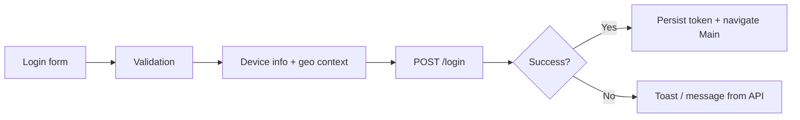

### C. Trip lifecycle (two trip types)

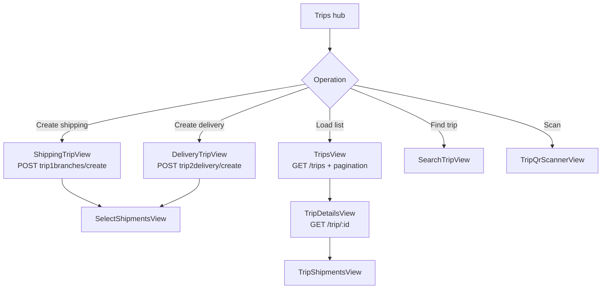

### D. Shipment lifecycle

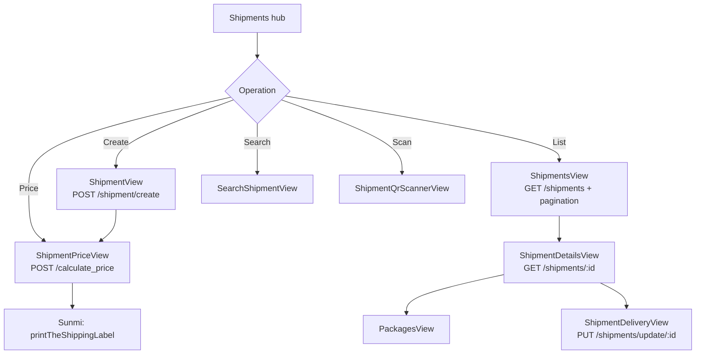

---

## Domain: trips vs shipments

| Concept | Backend cues (from `ApiEndpoints`) | App screens |
|---------|-----------------------------------|-------------|
| **Shipping trip** | `trip1branches/create`, trip reference lookups | `ShippingTripView`, `SelectShipmentsView`, `TripQrScannerView` |
| **Delivery trip** | `trip2delivery/create` | `DeliveryTripView` |
| **Trip discovery** | `GET /trips`, `GET /trip/reference/:ref`, `GET /trip/:id` | `TripsView`, `SearchTripView`, `TripDetailsView`, `TripShipmentsView` |
| **Shipment** | `POST /shipment/create`, `GET /shipments`, tracking, updates | Full `shipments/` tree under `views` |
| **Pricing** | `POST /calculate_price` | `ShipmentPriceView` |
| **Label / lading** | `GET /shipmentlading` (PDF URL flow in services) | Details / price flow |

---

## Networking and API surface

- **Base URL:** `https://app.ilex.sa/api/v1`
- **Client:** `ApiService` centralizes `getRequest`, `postRequest`, `putRequest` and normalizes **`DioException`** into a synthetic `Response` with `statusCode` and a parsed `statusMessage` when the backend returns structured errors.
- **Endpoints:** Declared as constants in `lib/core/constants/api_endpoints.dart` (login, user, cities, vehicles, clients, trips, shipments, pricing, password change, etc.).

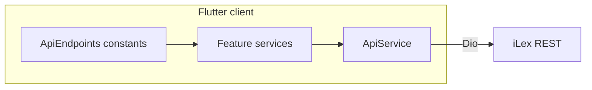

---

## Integrations deep dive

| Integration | Role in app |
|-------------|-------------|
| **Sunmi printer** | `ShipmentsController.printTheShippingLabel` — RTL-aligned `SunmiTextStyle`, separators, **QR codes**, paper cut (`SunmiPrinter.cutPaper`) for operational labels |
| **Firebase Messaging** | Token / notification plumbing in auth and messaging surfaces |
| **Geolocator + Geocoding** | Location context bundled with login and operational flows |
| **Connectivity Plus** | Splash listens for connectivity before version check |
| **Upgrader** | Compares installed vs store version; can force **App Update** screen and clear storage |
| **Device info** | Model name and network interface hints for device fingerprinting |
| **URL Launcher** | Opens Play Store / App Store for upgrades |
| **File saver / Signature** | Supporting shipment and proof workflows |

> **Printing** is documented in depth in the next section; Sunmi is the dedicated hardware path for branch **thermal receipts / bolissah (بوليصة شحن)**.

---

## Printing system (Sunmi thermal labels)

The app implements an **on-device thermal printing pipeline** for **shipping waybills** using **Sunmi** Android POS / printer hardware via the [`sunmi_printer_plus`](https://pub.dev/packages/sunmi_printer_plus) plugin. This is separate from **PDF download** (`downloadShippingLabelPDF`), which uses the API lading endpoint and `file_saver`—both options appear on `ShipmentPriceView` after a shipment exists.

<p align="center">
  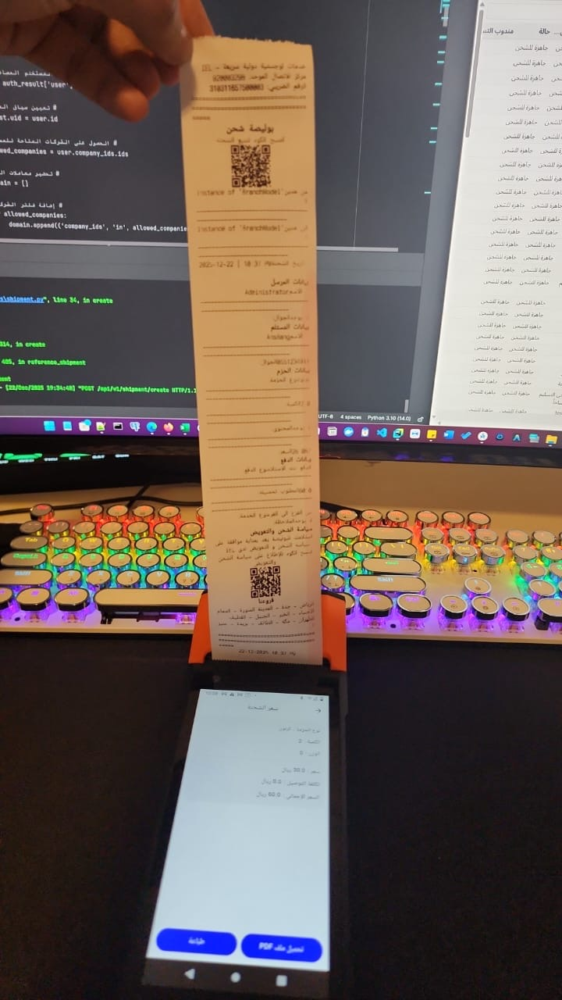
</p>

<p align="center">
  <sub><strong>Example output:</strong> a physical slip from <code>printTheShippingLabel</code>—header and title, scan-to-track QR, route and parties, packages, payment, legal text, and terms QR before the cut.</sub>
</p>

### Role in the product

| Output | Channel | Typical use |
|--------|---------|-------------|
| **Thermal ticket** | Sunmi built-in printer | Fast counter receipt: tracking QR, parties, packages, payment, legal copy |
| **PDF label** | HTTP → save to device | Archival / email / A4-style document |

### User entry point

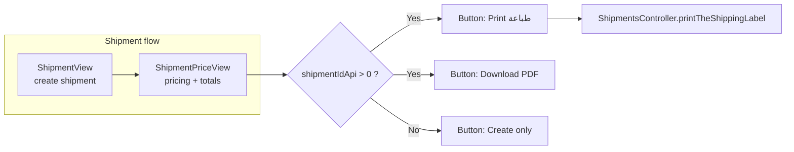

- **UI:** `lib/app/views/shipments/create/shipment_price_view.dart` — secondary actions after `shipmentIdApi != 0`.
- **Logic:** `lib/app/controllers/shipments/shipments_controller.dart` — method `printTheShippingLabel`.

### End-to-end data and device flow

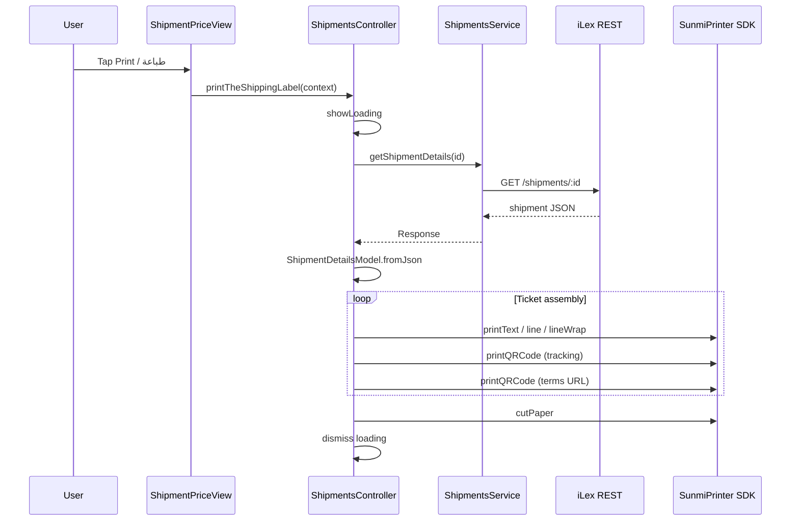

1. **Refresh data:** Always re-fetches **`GET`** shipment details for the current `_shipmentIdApi` so the slip matches server state (tracking number, packages, payment, etc.).
2. **Layout:** Imperative sequence of `SunmiPrinter.*` calls (no bitmap layout engine)—each block is explicit text, rules, spacing, and QR payloads.
3. **Finish:** `SunmiPrinter.cutPaper()` then close loading via `Get.back()`.
4. **Errors:** Non-200 responses and exceptions dismiss loading and **`showToast`** with API message or `AppStrings.unknownError`.

### Ticket layout (logical sections)

Sections map to the implementation order in `printTheShippingLabel`:

| # | Section | Content (examples) | Sunmi primitives |
|---|---------|-------------------|------------------|
| 1 | **Header** | Brand line (IEL / عربي), hotline, VAT number | `printText` (bold, `SunmiPrintAlign.RIGHT`), `line` |
| 2 | **Title** | Separator line, **بوليصة شحن** (large centered) | `printText` (fontSize 32, center), `lineWrap` |
| 3 | **Tracking QR** | “Scan to track”, QR = `shipmentDetails.barcode` | `printQRCode` |
| 4 | **Identifiers & route** | Tracking ref, origin city, destination city, shipment date/time | `printText`, rule lines |
| 5 | **Sender** | Name / phone (new vs existing sender fields) | `printText`, RTL-aware labels via `_isArabic` |
| 6 | **Receiver** | Name / phone (new vs existing receiver fields) | same |
| 7 | **Packages** | For each package: type, quantity, content, price; multi-package divider | `for` loop, optional “حزمة جديدة” block |
| 8 | **Payment** | Payment type, amount to collect, service type | `printText` |
| 9 | **Notes** | Free-text notes | `printText` |
| 10 | **Legal** | Policy title + disclaimer text | `printText` |
| 11 | **Terms QR** | QR → `https://iel.sa/terms-and-conditions` | `printQRCode` |
| 12 | **Branches** | Static city list (IEL network) | `printText` |
| 13 | **Footer** | Separator, **print timestamp** (device local, 12h + AM/PM) | `printText`, `lineWrap` |
| 14 | **Cut** | Physical end of job | `cutPaper()` |

### Arabic / RTL on paper

- Most body lines use **`SunmiPrintAlign.RIGHT`** so Arabic reads naturally on narrow roll paper.
- Helper **`_isArabic(text)`** swaps label word order when mixed Arabic/Latin appears (e.g. `من مدينة:` vs `:من مدينة`) so lines remain readable.
- Center alignment is reserved for titles, dividers, and QR captions.

### Hardware and deployment notes

- **Target devices:** Sunmi (or compatible) **Android POS terminals** with an integrated **58/80 mm thermal** printer and the vendor service running—`sunmi_printer_plus` talks to the device SDK.
- **iOS:** Sunmi path is **Android-centric**; iPhone builds may not expose the same printer API (verify before claiming iOS printing in CV bullets).
- **Field testing:** Validate paper width, DPI, and QR scannability after firmware updates; `lineWrap` counts tune tear position before `cutPaper()`.

### Related code references

| File | Responsibility |
|------|----------------|
| `lib/app/controllers/shipments/shipments_controller.dart` | `printTheShippingLabel`, Sunmi sequence, `ShipmentDetailsModel` |
| `lib/app/views/shipments/create/shipment_price_view.dart` | Print / PDF buttons |
| `lib/app/models/shipment_details_model.dart` | Parsed fields on the slip |
| `pubspec.yaml` | `sunmi_printer_plus: ^4.1.1` |

---

## Repository / file architecture

### Top-level `lib/` tree (canonical file list)

```text
lib/
├── main.dart
├── firebase_options.dart
├── app/
│   ├── bindings/          # GetX Bindings (lazy DI per feature)
│   ├── controllers/       # GetxController classes
│   ├── models/            # Data models / DTOs
│   ├── routes/            # AppRoutes (strings) + AppPages (GetPage list)
│   ├── services/          # ApiService + domain-specific HTTP services
│   └── views/             # Screens + reusable widgets
│       ├── auth/
│       ├── control_panel/
│       ├── main/
│       ├── more/
│       ├── notifications/
│       ├── shipments/     # create/ + view/
│       ├── splash/
│       ├── trips/         # create/ + view/
│       └── widgets/
└── core/
    ├── constants/         # API endpoints, colors, strings, assets
    ├── helpers/           # init, validation, dates, communication
    └── storage/           # StorageKeys + StorageService (GetStorage)
```

### Module dependency sketch

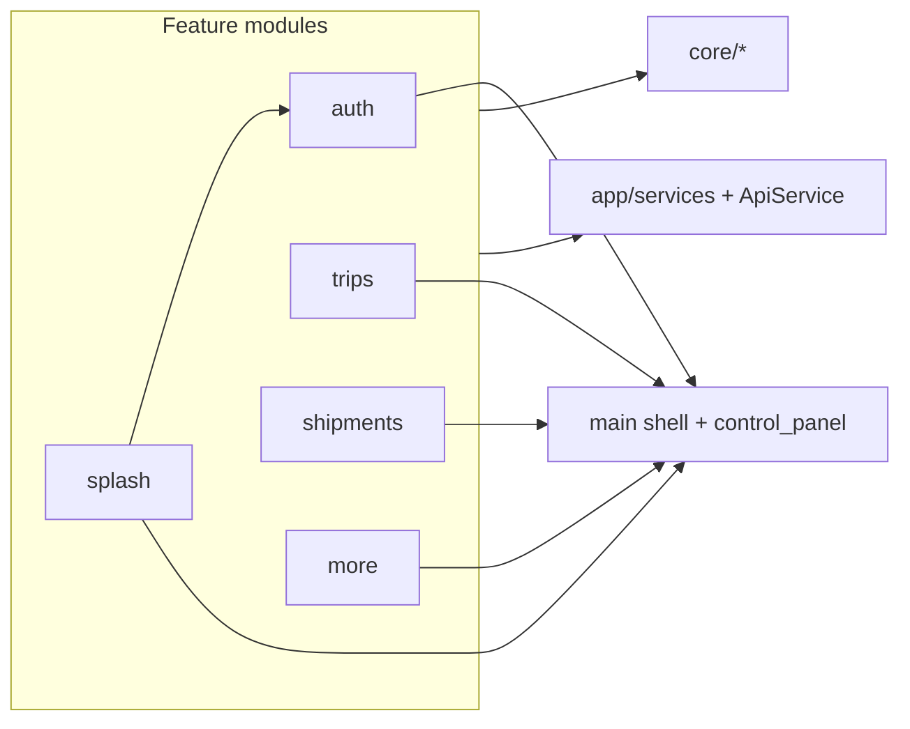

---

## Screen and route catalog

| Route constant | Screen | Typical binding |
|----------------|--------|-----------------|
| `/splashView` | `SplashView` | `SplashBinding` |
| `/appUpdateView` | `AppUpdateView` | `SplashBinding` |
| `/loginView` | `LoginView` | `AuthBinding` |
| `/forgotPasswordView` | `ForgotPasswordView` | — |
| `/mainView` | `MainView` | `MainBinding` |
| `/createShippingTripView` | `ShippingTripView` | `TripsBinding` |
| `/createDeliveryTripView` | `DeliveryTripView` | `TripsBinding` |
| `/selectShipmentsView` | `SelectShipmentsView` | — |
| `/tripQrScannerView` | `TripQrScannerView` | — |
| `/searchTripView` | `SearchTripView` | — |
| `/tripsView` | `TripsView` | `TripsBinding` |
| `/tripDetailsView` | `TripDetailsView` | — |
| `/tripShipmentsView` | `TripShipmentsView` | — |
| `/createShipmentView` | `ShipmentView` | `ShipmentsBinding` |
| `/shipmentPriceView` | `ShipmentPriceView` | — |
| `/searchShipmentView` | `SearchShipmentView` | — |
| `/shipmentQrScannerView` | `ShipmentQrScannerView` | — |
| `/shipmentsView` | `ShipmentsView` | `ShipmentsBinding` |
| `/shipmentDetailsView` | `ShipmentDetailsView` | — |
| `/packagesView` | `PackagesView` | — |
| `/shipmentDeliveryView` | `ShipmentDeliveryView` | — |
| `/profileDataView` | `ProfileDataView` | — |
| `/changePasswordView` | `ChangePasswordView` | — |

> **`NotificationsView`** exists under `app/views/notifications/` and can be wired from FCM handlers or menus depending on product configuration.

---

## Getting started

### Prerequisites

- [Flutter SDK](https://docs.flutter.dev/get-started/install) matching `environment.sdk: ^3.6.0`
- Xcode (iOS), Android Studio / SDK (Android)
- Firebase project with `firebase_options.dart` aligned to your bundle IDs

### Commands

```bash
cd /path/to/ilex-master
flutter pub get
flutter run
```

**Package name note:** `pubspec.yaml` declares `name: iel`. Store listings referenced in code include Android package `com.ielapp.app.iel` (see `SplashController.openAppStore`).

---

## Security and configuration notes

- **Secrets:** Do not commit production API keys or `google-services.json` / `GoogleService-Info.plist` if this repo is public; use CI secrets or local-only files.
- **Tokens:** `StorageService` + `StorageKeys.authToken` persist session; forced upgrade path may call `StorageService.removeAll()`.
- **Transport:** All API calls target HTTPS `app.ilex.sa`.

---

## Diagram index (for CV / portfolio export)

| Diagram | Topic |
|---------|--------|
| System context | External systems: API, Firebase, stores, Sunmi |
| Application architecture | Layers: View → Controller → Service → ApiService |
| Sequence | Typical REST call flow |
| Bootstrap | `InitServicesHelper` steps |
| Navigation | Splash → update gate → login vs main |
| Trip workflow | Create, list, search, QR, details |
| Shipment workflow | Create, price, print, list, delivery |
| **Printing** | Entry flow (price screen → controller) |
| **Printing** | Sequence: fetch details → Sunmi layout → `cutPaper` |
| File tree | `lib/` module layout |

---

### License / attribution

This README describes the **iel** Flutter package as found in this workspace. Backend and brand assets belong to their respective owners; adjust names and links to match **your** role and employment terms on your CV.
