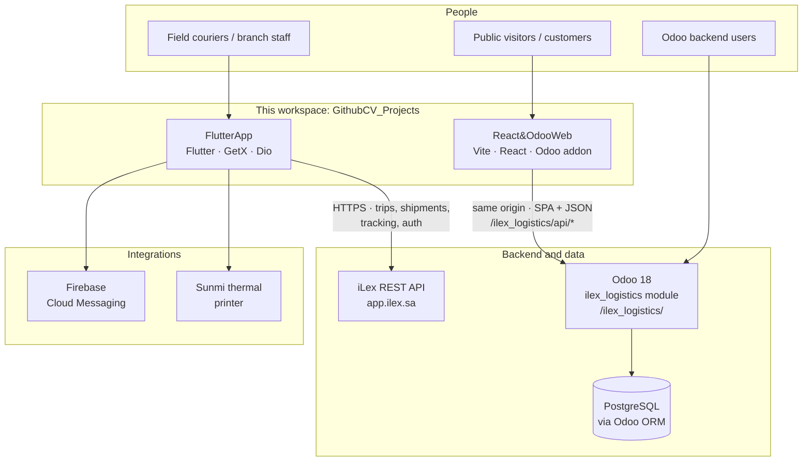

# GithubCV Projects — ILEX / iLex logistics portfolio

This workspace groups two production-oriented **ILEX (iLex)** logistics projects: a **field operations mobile app** and a **public web portal** embedded in Odoo. Each folder ships its own long-form documentation (architecture, Mermaid diagrams, setup, and CV-ready bullets).

---

## Projects at a glance

| Folder | Stack | Role |
|--------|--------|------|
| [**FlutterApp**](FlutterApp/) | Flutter / Dart 3, GetX, Dio, Firebase, Sunmi thermal printing | Courier-facing **mobile client** for trips, shipments, tracking, QR, push notifications, Arabic RTL, and on-device label printing |
| [**React&OdooWeb**](React&OdooWeb/) | React 18, Vite 5, TypeScript, Odoo 18, PostgreSQL (via ORM) | **Marketing and self-service site**: landing, services, blog, shipment tracking, quotes, auth flows—served at `/ilex_logistics/` with same-origin JSON APIs |

Together they illustrate **end-to-end logistics software**: mobile operations talking to `app.ilex.sa`, and a public Odoo-hosted SPA for discovery, tracking, and lead capture.

---

## How everything fits together

The diagram below is a **single portfolio view**: both folders in this repo, who uses them, and which systems they talk to. (GitHub, GitLab, and many Markdown viewers render [Mermaid](https://mermaid.js.org/) natively.)

**Quick read:** **FlutterApp** is the operations client against the **iLex API**; **React&OdooWeb** is the public/marketing and self-service surface **inside Odoo**, with persistence through **PostgreSQL** only via the ORM—not from the browser.

---

## Where to read the full docs

### [FlutterApp — iLex / IEL mobile app](FlutterApp/README.md)

The **[FlutterApp/README.md](FlutterApp/README.md)** file is a portfolio-grade deep dive:

- Product scope (auth, trips, shipments, profile, notifications, Sunmi printing, Arabic locale)
- Stack (GetX, Dio, FCM, geolocation, infinite scroll, QR, connectivity, upgrader)
- Layered architecture (views → controllers → services → `ApiService`)
- Navigation graph, user journeys, API surface (`https://app.ilex.sa/api/v1`)
- **Printing pipeline** for Sunmi thermal waybills (layout sections, RTL on paper, code map)
- Repository layout under `lib/`, route catalog, getting started, security notes

Use it when you need **mobile + field logistics + thermal printing** detail for a CV or technical interview.

### [React&OdooWeb — ILEX Logistics Odoo module + React SPA](React&OdooWeb/README.project.md)

Detailed documentation lives in **[React&OdooWeb/README.project.md](React&OdooWeb/README.project.md)** (the single extended README for that tree):

- Odoo 18 addon **`ilex_logistics`**: controllers serve the Vite build and expose `/ilex_logistics/api/*`
- React SPA: hash routing, lazy pages, EN/AR i18n, landing services blog track quote login
- Mermaid diagrams: module deps, system context, request sequences, deploy flow, ORM layers
- Prerequisites, **frontend-only** quick start (`npm run dev`), and **full Odoo + PostgreSQL** setup
- API table, DB model pointers, file tree, optional dev proxy to Odoo (`VITE_ODOO_URL`), CV citation line

Use it when you need **enterprise CMS + SPA + same-origin APIs** detail.

---

## Quick navigation

- Mobile app source and **README**: [`FlutterApp/`](FlutterApp/)
- Web / Odoo source and **README.project.md**: [`React&OdooWeb/`](React&OdooWeb/)

---

## Note on folder naming

The web project folder is named **`React&OdooWeb`**. Some browsers encode the ampersand as **`%26`** in the address bar; file paths on disk use **`React&OdooWeb`** as shown above.
