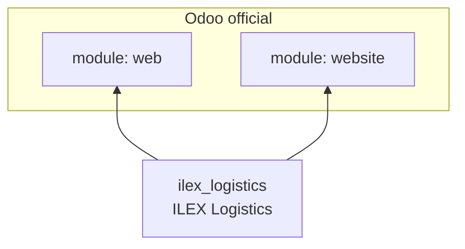
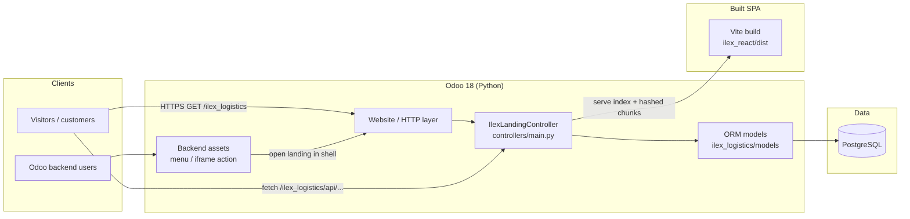
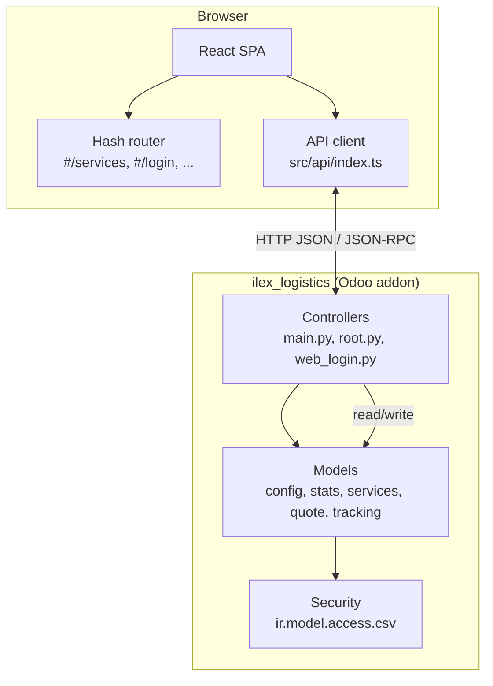
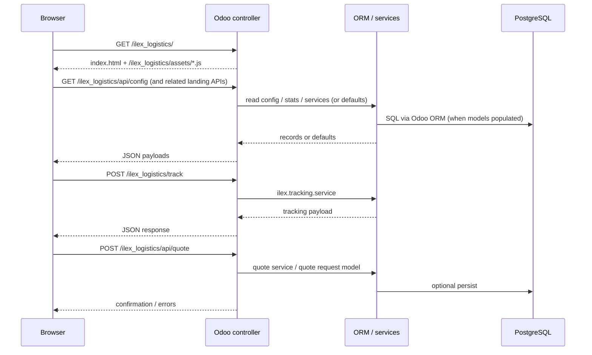
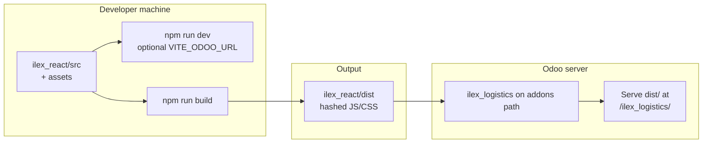
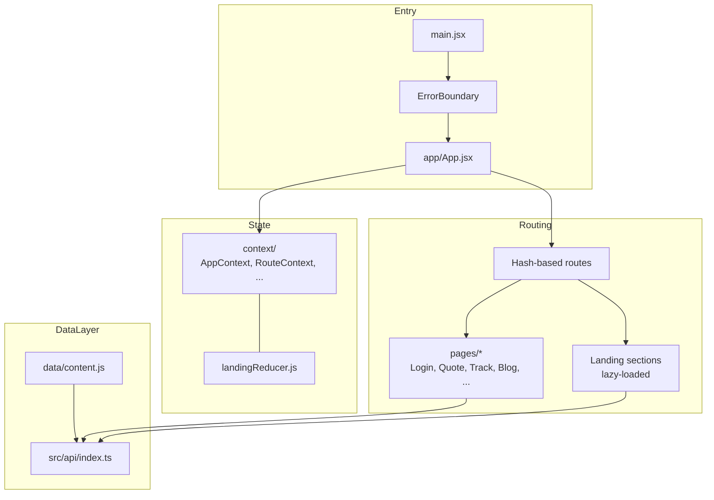
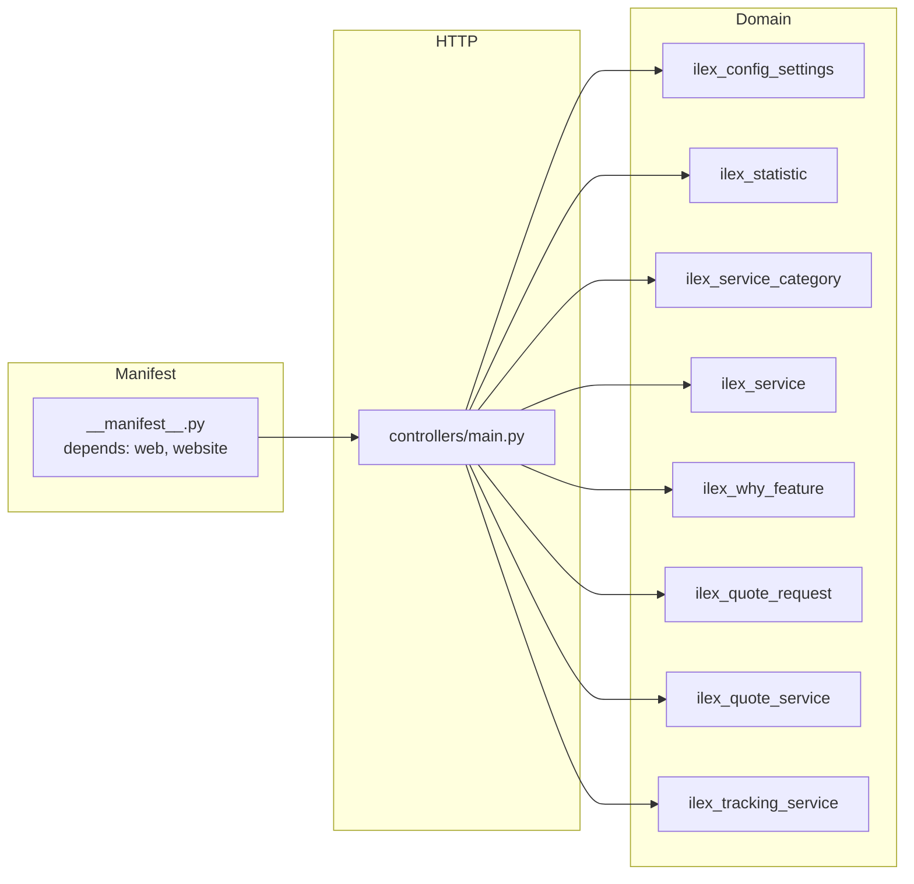
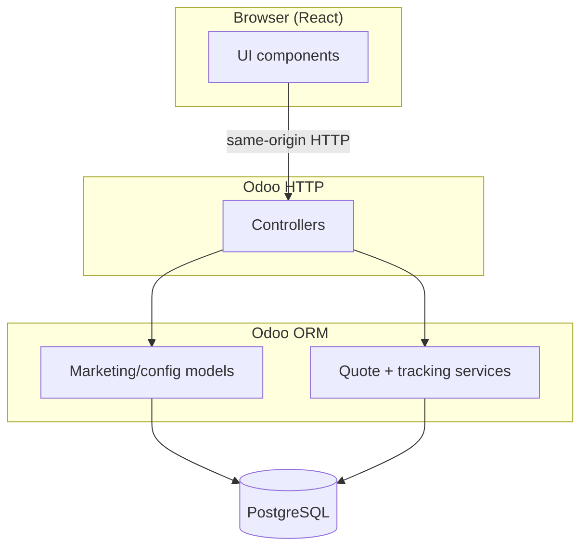
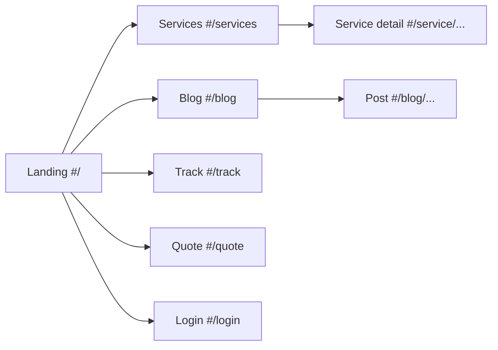

# ILEX Logistics — complete project documentation

<p align="center">
  
</p>

<p align="center">
  <sub>Wordmark: <code>linesLogo.svg</code> at repo root (full React/Odoo app uses assets under <code>ilex_logistics/ilex_react/</code> when deployed)</sub>
</p>

---

**IEL_custom_module** is an **Odoo 18** addon that embeds a **Vite + React 18** logistics web application: marketing landing, service catalog and detail pages, blog-style posts, shipment tracking, quote requests, and login / password-reset style flows. The SPA is served from **`/ilex_logistics/`** on the same origin as **JSON (and JSON-RPC-style) APIs** implemented in Python controllers; data can come from **Odoo ORM → PostgreSQL** or from static defaults while you integrate.

This file is the **single extended README**: product overview, **architecture & workflow diagrams** (Mermaid, renders on GitHub), setup, API pointers, repository layout, and CV-oriented summary.

---

## Table of contents

1. [What this project is](#what-this-project-is)
2. [Features (user-visible)](#features-user-visible)
3. [Technology stack](#technology-stack)
4. [Diagrams](#diagrams)
   - [Odoo module dependencies](#odoo-module-dependencies)
   - [System context](#system-context)
   - [Logical architecture](#logical-architecture)
   - [Request sequence](#request-sequence)
   - [Develop → build → deploy](#develop--build--deploy)
   - [React SPA structure](#react-spa-structure)
   - [Odoo backend layers](#odoo-backend-layers)
   - [Data & integration](#data--integration)
   - [Feature / route map (conceptual)](#feature--route-map-conceptual)
5. [Prerequisites](#prerequisites)
6. [Quick start (frontend only)](#quick-start-frontend-only)
7. [Full setup (Odoo + PostgreSQL)](#full-setup-odoo--postgresql)
8. [Database](#database)
9. [API integration](#api-integration)
10. [DB / ORM integration](#db--orm-integration)
11. [Repository & file tree](#repository--file-tree)
12. [Frontend scripts & static assets](#frontend-scripts--static-assets)
13. [Optional: dev server against Odoo](#optional-dev-server-against-odoo)
14. [Performance & delivery notes](#performance--delivery-notes)
15. [How to cite on a CV](#how-to-cite-on-a-cv)
16. [Other docs in this repo](#other-docs-in-this-repo)
17. [License](#license)

---

## What this project is

| Layer | Role |
|-------|------|
| **React SPA** | UI, client-side hash routing (`#/…`), lazy-loaded pages, bilingual (EN/AR), calls same-origin APIs. |
| **Odoo controllers** | Serve `index.html` and built assets from `ilex_react/dist/`, expose `/ilex_logistics/api/*`, tracking and quote endpoints. |
| **Odoo models / services** | Config, statistics, services, benefits, quote storage, tracking resolution (stub or custom). |
| **PostgreSQL** | Odoo’s database; the browser never connects to it directly. |

The module name in Apps is **ILEX Logistics** (`ilex_logistics`). The Vite **`base`** path is **`/ilex_logistics/`** and must stay aligned with the controller’s mounted path.

---

## Features (user-visible)

- **Landing:** hero, quick track, stats, services preview, why / how-it-works, map, clients, testimonials, CTA.
- **Services:** full list and per-service detail (`#/services`, `#/service/...`).
- **Blog / posts:** listing and post detail (`#/blog`, `#/blog/...`).
- **Tracking:** dedicated track flow and status UI (demo numbers documented in quick start).
- **Quote:** quote request form wired to backend.
- **Auth-style pages:** login, forgot password, verify code, reset (Odoo session / core routes where applicable).
- **Backend:** optional Odoo menu action to open the same SPA inside the backend shell.

---

## Technology stack

| Area | Technologies |
|------|----------------|
| Frontend | React 18, Vite 5, client-side routing (hash), CSS modules/partials, TypeScript in `src/api/index.ts` |
| i18n | Custom translations + locale storage (English / Arabic) |
| Backend | Python 3, Odoo 18 (`web`, `website`) |
| Data | PostgreSQL via Odoo ORM |
| Tooling | npm, optional `rollup-plugin-visualizer`, Sharp-based `npm run optimize:images` |

---

## Diagrams

### Odoo module dependencies



---

### System context



---

### Logical architecture



---

### Request sequence



---

### Develop → build → deploy



---

### React SPA structure



---

### Odoo backend layers



---

### Data & integration



**Invariant:** the React app **never** uses a raw PostgreSQL client. All persistence goes through Odoo.

---

### Feature / route map (conceptual)



---

## Prerequisites

- **Node.js 18+** (React / Vite build)
- **Odoo 18** with modules **`web`** and **`website`**
- **PostgreSQL 12+** (used by Odoo for a full backend deployment)

---

## Quick start (frontend only)

No Odoo or PostgreSQL required for UI development with static defaults:

```bash
cd ilex_logistics/ilex_react
npm install
npm run dev
```

Open **http://localhost:5173/ilex_logistics/** (path includes the Vite `base`).

---

## Full setup (Odoo + PostgreSQL)

### 1. PostgreSQL

Install and start PostgreSQL. Example role for Odoo:

```sql
CREATE ROLE odoo LOGIN PASSWORD 'your_password' CREATEDB;
```

Odoo will create its own databases; you do not need a separate `ilex` database by hand.

### 2. Odoo configuration

**Config file** (e.g. `~/.odoorc` or `/etc/odoo/odoo.conf`):

```ini
[options]
admin_passwd = your_master_password
db_host = localhost
db_port = 5432
db_user = odoo
db_password = your_password
```

**Or environment** when starting Odoo:

```bash
export PGHOST=localhost PGPORT=5432 PGUSER=odoo PGPASSWORD=your_password
./odoo-bin --addons-path=/path/to/addons
```

### 3. Add the module to Odoo’s addons path

Either add the repository root or copy the addon folder:

```bash
# Option A: addons path includes this repo
./odoo-bin --addons-path=/path/to/IEL_custom_module,/path/to/odoo/addons

# Option B: copy addon only
cp -r /path/to/IEL_custom_module/ilex_logistics /path/to/odoo/addons/
```

### 4. Install the module

In Odoo **Apps**, **Update Apps List** (developer mode if needed), search **ILEX Logistics**, click **Install**.

### 5. Build the React app

```bash
cd ilex_logistics/ilex_react
npm install
npm run build
```

Odoo serves files from **`ilex_react/dist/`** at **`/ilex_logistics/`**. No manual copy into `static/` is required for the SPA entry.

### 6. Open the application

- **Public SPA:** `http://<odoo-host>:8069/ilex_logistics/`
- **From backend:** **ILEX → Landing / Website** (same app in the shell)

**Tracking demo:** on the landing page, try **55555** (also **11111**, **22222**, **33333**, **44444**) in the track field.

---

## Database

- The **browser never connects to PostgreSQL**. All access is through **Odoo**.
- Odoo uses one PostgreSQL database per database “instance” you connect to.
- Typical model/table names after installation include:
  - **`ilex_config_settings`** — hero and feature flags
  - **`ilex_statistic`** — headline stats
  - **`ilex_service_category`**, **`ilex_service`** — services taxonomy
  - **`ilex_why_feature`** — benefit cards
  - **`ilex_quote_request`** — quote submissions
  - Plus tracking/quote **services** (see models package)

---

## API integration

Primary implementation file: **`ilex_logistics/controllers/main.py`**.

| What | Route / path | Notes |
|------|----------------|------|
| SPA shell | `GET /ilex_logistics/`, client `/#/...` | `_serve_spa()`, hashed assets under `/ilex_logistics/assets/` |
| Tracking | `POST /ilex_logistics/track` | Delegates to `ilex.tracking.service` |
| Quote | `POST /ilex_logistics/api/quote` | Quote service / `ilex.quote.request` |
| Config | `GET /ilex_logistics/api/config` | Defaults or DB-backed |
| Landing payloads | `GET /ilex_logistics/api/<name>` | stats, services, testimonials, etc. |

**Customization:**

- Override controller methods for different payloads or external HTTP calls.
- Implement **`get_tracking_info`** on the tracking service for carrier APIs or internal DB.
- Wire quotes to persist via **`ilex.quote.service`** / **`ilex.quote.request`** or forward externally.

**Frontend base URL:** same origin when the app is served from Odoo. For a separate API host, set **`VITE_API_URL`** in `.env` / `.env.production` and rebuild; see **`getBase()`** in **`ilex_logistics/ilex_react/src/api/index.ts`**.

---

## DB / ORM integration

| Path | Purpose |
|------|--------|
| **`ilex_logistics/models/ilex_config_settings.py`** | Configuration |
| **`ilex_logistics/models/ilex_statistic.py`** | Stats |
| **`ilex_logistics/models/ilex_service_category.py`**, **`ilex_service.py`** | Services |
| **`ilex_logistics/models/ilex_why_feature.py`** | Benefits |
| **`ilex_logistics/models/ilex_quote_request.py`**, **`ilex_quote_service.py`** | Quotes |
| **`ilex_logistics/models/ilex_tracking_service.py`** | Tracking logic |
| **`security/ir.model.access.csv`** | Access rights |

Controllers use **`request.env['model']`** and the Odoo cursor; replace static JSON in **`main.py`** with **`search_read`** (and similar) when models and security are fully enabled in **`__manifest__.py`**.

---

## Repository & file tree

```
IEL_custom_module/
├── README.md                    # Short entry: link to this file for full docs
├── README.project.md            # This file — complete documentation + diagrams
├── install_ilex_no_docker.md    # Install without Docker
│
└── ilex_logistics/              # Odoo 18 addon
    ├── __init__.py
    ├── __manifest__.py
    ├── README.md
    ├── MODULE_STRUCTURE.md
    ├── ROUTES.md
    │
    ├── controllers/
    │   ├── __init__.py
    │   ├── main.py              # SPA + APIs
    │   ├── root.py
    │   └── web_login.py
    │
    ├── models/
    │   ├── __init__.py
    │   ├── ir_http.py
    │   ├── ilex_config_settings.py
    │   ├── ilex_statistic.py
    │   ├── ilex_service_category.py
    │   ├── ilex_service.py
    │   ├── ilex_why_feature.py
    │   ├── ilex_quote_request.py
    │   ├── ilex_quote_service.py
    │   ├── ilex_tracking_service.py
    │   └── ilex_api_integration.py
    │
    ├── views/
    ├── security/
    │   └── ir.model.access.csv
    ├── data/
    ├── static/
    │   └── src/ilex_iframe_action/
    │
    └── ilex_react/
        ├── STRUCTURE.md
        ├── vite.config.js       # base: /ilex_logistics/
        ├── package.json
        ├── index.html
        ├── build_for_odoo.sh
        ├── scripts/
        │   └── optimize-raster-images.mjs
        ├── public/              # Static public URLs (fonts, mirrored assets)
        ├── assets/              # Source images (PNG + optional avif/webp)
        ├── dist/                # Production build output (generated)
        └── src/
            ├── main.jsx
            ├── app/
            ├── api/index.ts
            ├── components/
            ├── context/
            ├── data/
            ├── hooks/
            ├── i18n/
            ├── layouts/
            ├── pages/
            └── styles/
```

---

## Frontend scripts & static assets

| Command | Purpose |
|---------|--------|
| **`npm run dev`** | Vite dev server (port 5173, base `/ilex_logistics/`) |
| **`npm run build`** | Production bundle → **`dist/`** (hashed filenames) |
| **`npm run build:analyze`** | Build with bundle visualizer |
| **`npm run optimize:images`** | Regenerate **AVIF/WebP** next to PNGs in **`assets/icons`** and **`assets/servicesImages`**, mirror into **`public/assets/`** |

Hero and other surfaces use responsive images (**AVIF / WebP / PNG**) where generated; run **`optimize:images`** after changing source PNGs.

---

## Optional: dev server against Odoo

In **`ilex_logistics/ilex_react/.env`**:

```
VITE_ODOO_URL=http://localhost:8069
```

Then **`npm run dev`**: the UI loads from Vite while API calls target your Odoo instance.

---

## Performance & delivery notes

- **Code splitting:** lazy-loaded route pages and some below-the-fold sections.
- **Caching:** content-hashed **`dist/assets/*`** files are safe to cache long-term.
- **Images:** `<picture>` / **`image-set`** patterns prefer modern formats when present.
- **Fonts:** self-hosted (**`@fontsource/*`**) and reduced Font Awesome subset where applicable.

---

## How to cite on a CV

**One line:** Built a **Vite/React** logistics portal (landing, services, tracking, quote, auth flows) as an **Odoo 18** module with **same-origin APIs** and **PostgreSQL** via Odoo ORM, not direct browser-to-DB access.

**Skills keywords:** React, Vite, TypeScript, JavaScript, Python, Odoo, PostgreSQL, SPA, REST/JSON, i18n, enterprise integration.

**Elevator pitch:** *A marketing and operations front end lives inside Odoo: one deployment, one domain, controllers expose JSON for the SPA, and tracking/quote logic is isolated in services so carriers and CRM workflows can replace stubs without rewriting the UI.*

---

## Other docs in this repo

| File | Contents |
|------|----------|
| [README.md](README.md) | Brief intro + pointer here |
| [install_ilex_no_docker.md](install_ilex_no_docker.md) | Install path details |
| [ilex_logistics/README.md](ilex_logistics/README.md) | Addon quick pointer |
| [ilex_logistics/MODULE_STRUCTURE.md](ilex_logistics/MODULE_STRUCTURE.md) | Addon folders |
| [ilex_logistics/ROUTES.md](ilex_logistics/ROUTES.md) | Detailed HTTP routes |
| [ilex_logistics/ilex_react/STRUCTURE.md](ilex_logistics/ilex_react/STRUCTURE.md) | React `src/` layout |

---

## License

**LGPL-3** (see **`ilex_logistics/__manifest__.py`**).
